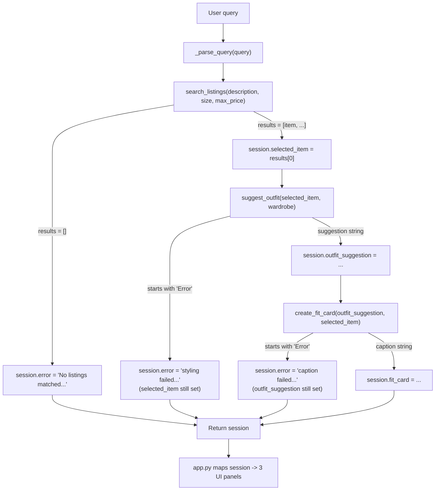

# FitFindr — planning.md

> Complete this document before writing any implementation code.
> Your spec and agent diagram are what you'll use to direct AI tools (Claude, Copilot, etc.) to generate your implementation — the more specific they are, the more useful the generated code will be.
> Your planning.md will be reviewed as part of your submission.
> Update it before starting any stretch features.

---

## Tools

### Tool 1: search_listings

**What it does:**
Filters the mock listings dataset down to items matching a free-text description, an optional exact size, and an optional price ceiling, ranking matches by how many description keywords they contain.

**Input parameters:**
- `description` (str): free-text keywords describing what the user wants, e.g. `"vintage graphic tee"`. Matched case-insensitively against each listing's title, description, category, brand, and style_tags.
- `size` (str | None): size to filter on, e.g. `"M"`. Matching is case-insensitive and substring-based in both directions, so `"M"` matches a listing sized `"S/M"`. `None` skips size filtering.
- `max_price` (float | None): maximum acceptable price, inclusive. `None` skips price filtering.

**What it returns:**
`list[dict]` — every listing that passed the size/price filters and scored at least one keyword match, sorted by score descending. Each dict has the full listing record (`id`, `title`, `description`, `category`, `style_tags`, `size`, `condition`, `price`, `colors`, `brand`, `platform`). Returns `[]` (never `None`, never raises) if nothing matches, including for a blank description.

**What happens if it fails or returns nothing:**
An empty list is a valid, expected outcome, not an exception. The agent checks for it explicitly: if `search_listings` returns `[]`, the planning loop stops immediately, records which filters were active, and tells the user to loosen their size/price filter or rephrase the description. `suggest_outfit` is never called with empty input.

---

### Tool 2: suggest_outfit

**What it does:**
Given one found item and the user's wardrobe, asks the LLM to suggest how to style the item — either a specific pairing with named wardrobe pieces, or general advice if there's no wardrobe data yet.

**Input parameters:**
- `new_item` (dict): a listing dict, as returned by `search_listings`.
- `wardrobe` (dict): `{"items": [ {id, category, description, color, style_tags}, ... ]}`. `items` may be empty.

**What it returns:**
`str` — a 2–4 sentence styling suggestion. If `wardrobe["items"]` is empty, this is general styling advice for the item (what categories/vibes would pair well, plus one styling tip) rather than a wardrobe-specific pairing.

**What happens if it fails or returns nothing:**
An empty wardrobe is **not** treated as a failure — it's handled by the general-advice branch above. The only real failure mode is the LLM call itself raising (network/API issue), in which case the function returns a string starting with `"Error"` instead of raising. The agent checks for that `"Error"` prefix and stops before calling `create_fit_card`, but keeps `search_results`/`selected_item` in the session so the found item still shows up.

---

### Tool 3: create_fit_card

**What it does:**
Turns a finished outfit suggestion into a short, shareable, caption-style line for the item, mentioning its name, price, and platform naturally.

**Input parameters:**
- `outfit` (str): the outfit suggestion string produced by `suggest_outfit`.
- `new_item` (dict): the listing dict the outfit was built around.

**What it returns:**
`str` — a 2–4 sentence casual caption. Uses a high LLM temperature (1.1) specifically so that calling it twice on the same input produces different wording each time.

**What happens if it fails or returns nothing:**
If `outfit` is empty/whitespace-only, or `new_item` is missing, the function returns a descriptive `"Error: ..."` string immediately — no LLM call is attempted. If the LLM call itself fails, it also returns an `"Error: ..."` string rather than raising. The agent checks for the prefix; on failure it still returns the item and outfit suggestion (a partial success) instead of discarding everything.

---

## Planning Loop

`run_agent()` runs the tools in a fixed order but does **not** call all three unconditionally — each step's outcome decides whether the next one runs at all:

1. Parse the raw query into `description` / `size` / `max_price` (regex-based — see State Management).
2. Call `search_listings`. **If it returns `[]`, stop immediately**: set `session["error"]` describing which filters were active and what to try instead, and return. `suggest_outfit` and `create_fit_card` are never reached.
3. Otherwise, take the top-ranked result as `selected_item` and call `suggest_outfit`.
4. **If the result starts with `"Error"`, stop**: set `session["error"]` with that detail and return early — `create_fit_card` is skipped — but `search_results`/`selected_item` remain populated.
5. Otherwise, call `create_fit_card` with the outfit suggestion and selected item.
6. **If that result starts with `"Error"`**, set `session["error"]` but keep `outfit_suggestion` populated (partial success) rather than discarding it.
7. Return the completed session.

The three decision points — one empty-list check, two `"Error"`-prefix checks — are what make this a planning loop rather than a fixed pipeline: what a tool returns determines whether the next tool is called.

---

## State Management

Everything for one interaction lives in the `session` dict from `_new_session()`: `query`, `parsed`, `search_results`, `selected_item`, `wardrobe`, `outfit_suggestion`, `fit_card`, `error`. Each field is written exactly once, immediately after the step that produces it succeeds.

Query parsing (`_parse_query`) is regex-based rather than an LLM call, for two reasons: it keeps parsing deterministic/testable without an API key, and the query patterns this project uses (`"under $30"`, `"size M"`) don't need general NLU. It extracts a dollar amount and a `"size X"` token from anywhere in the query, takes the query's first sentence as the description candidate (later sentences, like wardrobe context — *"I mostly wear baggy jeans..."* — aren't meant to be searched against listings), and strips filler words (`"a"`, `"looking"`, `"under"`, `"i'm"`, etc. — the same stopword list `search_listings` uses internally, imported as `SEARCH_STOPWORDS`, so parse-time and search-time cleanup stay consistent) out of what's left.

Downstream tools read their main input straight from the session: `suggest_outfit(session["selected_item"], wardrobe)`, then `create_fit_card(outfit, session["selected_item"])` — the item found in step 2 flows through without the user re-entering anything. `app.py` doesn't hold state of its own; it reads the finished session once and maps it onto the three UI panels.

---

## Error Handling

| Tool | Failure mode | Agent response |
|------|-------------|----------------|
| search_listings | No results match the query | Returns `[]`. Agent stops the loop, tells the user which size/price filters were active, and suggests loosening them or rephrasing the description. `suggest_outfit`/`create_fit_card` are never called. |
| suggest_outfit | Wardrobe is empty | **Not a failure.** Returns general styling advice for the item instead of a wardrobe-specific pairing — the loop proceeds normally to `create_fit_card`. |
| suggest_outfit | LLM call fails (network/API) | Returns an `"Error: ..."` string. Agent stops before `create_fit_card`, sets `session["error"]` with the detail, but keeps the found item visible. |
| create_fit_card | Outfit input is missing or incomplete | Returns an `"Error: ..."` string immediately, no LLM call made. (In practice the planning loop's ordering means this is only reachable if `create_fit_card` is called directly outside the loop, but the tool guards independently regardless.) |
| create_fit_card | LLM call fails | Returns an `"Error: ..."` string. Agent surfaces the item and outfit suggestion (partial success) alongside the caption error rather than discarding everything. |

---

## Architecture

---

## AI Tool Plan

**Milestone 3 — Individual tool implementations:**
Used Claude, given the Tool 1/2/3 spec blocks above (exact inputs, return shape, and failure-mode description) one tool at a time, plus the note that `search_listings` needed to be testable without the `groq` package/API key. Verified `search_listings` by running the assignment's three example queries by hand and checking the size/price filters and empty-result case. For `suggest_outfit`/`create_fit_card`, verified the guard clauses trigger correctly on empty wardrobe / empty outfit input before trusting the LLM-calling paths, and read through the prompts to confirm they matched the "sounds like a real caption, not an ad" requirement from the spec.

**Milestone 4 — Planning loop and state management:**
Used Claude, given the full Mermaid diagram above plus the "Planning Loop" and "State Management" sections, and asked it to implement `run_agent()` plus a `_parse_query()` helper (since `run_agent` takes a single free-text query, not pre-split parameters). Verified by running the no-results case directly and printing the session dict — confirmed `outfit_suggestion` and `fit_card` stayed `None`, proving `suggest_outfit`/`create_fit_card` were genuinely never reached, not just fast-failing. Also unit-tested `_parse_query` against all five example queries plus the longer multi-sentence walkthrough query to confirm size/price extraction and filler-word cleanup worked before wiring it into the loop.

---

## A Complete Interaction (Step by Step)

**Example user query:** "I'm looking for a vintage graphic tee under $30. I mostly wear baggy jeans and chunky sneakers. What's out there and how would I style it?"

**Step 1:**
`_parse_query()` extracts `max_price=30.0`, `size=None`, and takes the first sentence ("I'm looking for a vintage graphic tee under $30") as the description candidate, then strips the price phrase and filler words (`"I'm"`, `"looking"`, `"for"`, `"a"`, `"under"`) down to `description="vintage graphic tee"`. `search_listings("vintage graphic tee", size=None, max_price=30.0)` is called.

**Step 2:**
Two listings match ("Faded Band Tee — Nirvana 1994", $22 and "Vintage Graphic Tee — Grateful Dead", $19), ranked by keyword overlap. The top match is stored as `session["selected_item"]`. Because results were non-empty, the loop proceeds to `suggest_outfit(selected_item, wardrobe)` — passing along the wardrobe the user selected in the UI (the second and third sentences of the original query, about wearing baggy jeans and sneakers, aren't parsed structurally; they're the kind of detail a populated wardrobe object would already capture).

**Step 3:**
`suggest_outfit` returns a styling suggestion, e.g. "Pair this with your baggiest jeans and chunky sneakers for an easy 90s-grunge throwback — tuck just the front hem in." Since it doesn't start with `"Error"`, the loop proceeds to `create_fit_card(outfit_suggestion, selected_item)`, which returns a short caption, e.g. "thrifted this faded band tee for $22 on depop and it's basically made for my chunky sneakers 🖤".

**Final output to user:**
All three panels populate: the found item (title, price, platform, condition), the styling suggestion, and the caption. `session["error"]` is `None` throughout.

**Error path (for contrast):** if `search_listings` had returned `[]` (e.g. for "designer ballgown size XXS under $5"), the loop would set `session["error"]` and return immediately after Step 1 — `suggest_outfit` and `create_fit_card` would never be called.
